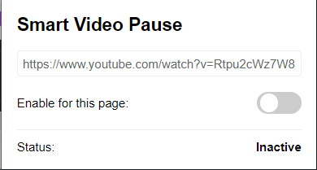

# 🎧 SMART AUDIO PAUSE

Automatically pause and resume video/audio when switching tabs in Chrome.

---

## 🚀 FEATURES

- ⏸️ **Auto-pause** videos and audio when the tab becomes inactive  
- ▶️ **Auto-resume** playback when you return  
- 🌍 Works across most media websites  
- ⚙️ Toggle between:
  - Pause for **all websites**
  - Pause for **this specific URL**

---

## ⚠️ WARNING

> ⚠️ **Does not work with Chrome’s "Always Active Window" feature.**  
> Make sure no extensions or settings are keeping inactive tabs active.

---

## 🔧 INSTALLATION

1. Download or clone this repo
2. Go to `chrome://extensions/`
3. Enable **Developer mode**
4. Click **Load unpacked**
5. Select the extension folder

---

## 🖥️ PREVIEW

  

---

## 💡 NOTES

- Some websites with custom players may not fully support auto-pause
- For best results, allow autoplay in site settings

---

## 📄 LICENSE

MIT License
